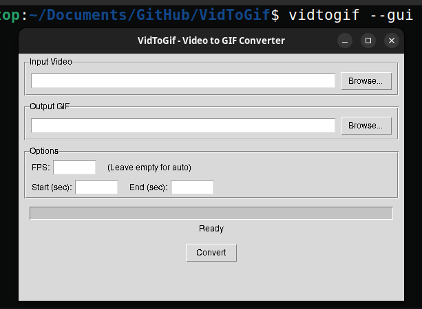

# VidToGif

一个简单高效的视频转 GIF 工具，支持保持原始分辨率输出。提供命令行 (CLI) 和图形界面 (GUI) 两种使用方式。

[English Documentation](README.md)

## 功能特性

- 支持任意视频格式（MP4、AVI、MOV、MKV、WMV、FLV、WebM 等）转换为 GIF
- 保持原始视频分辨率（等大输出）
- 可调节输出帧率 (FPS)
- 支持按时间段截取（设定起止时间）
- 命令行界面带进度条显示
- 图形界面支持文件浏览、参数设置和进度显示
- 跨平台支持（Windows、macOS、Linux）

## 安装

### 从 PyPI 安装

```bash
pip install vidtogif
```

### 从源码安装

```bash
git clone https://github.com/cycleuser/Vid2Gif.git
cd Vid2Gif
pip install -r requirements.txt
pip install .
```

## 使用方法

### 命令行 (CLI)

基本转换（输出文件默认为 `<输入文件名>.gif`）：

```bash
vidtogif input.mp4
```

指定输出路径：

```bash
vidtogif input.mp4 -o output.gif
```

设置输出帧率和时间范围：

```bash
vidtogif input.mp4 --fps 15 --start 2.5 --end 10
```

作为 Python 模块运行：

```bash
python -m vidtogif input.mp4
```

查看帮助信息：

```bash
vidtogif --help
```

### 图形界面 (GUI)

启动图形界面：

```bash
vidtogif --gui
```

或者：

```bash
python -m vidtogif --gui
```



图形界面提供以下功能：

1. **输入视频** - 浏览并选择任意视频文件
2. **输出 GIF** - 选择 GIF 保存路径（自动填充）
3. **选项设置** - 设定帧率、起始时间和结束时间
4. **进度条** - 实时显示转换进度
5. **转换按钮** - 开始转换

## 命令行参数

```
用法: vidtogif [-h] [-o OUTPUT] [--fps FPS] [--start START] [--end END] [--gui] [-v] [input]

将视频文件转换为原始分辨率的 GIF。

位置参数:
  input                 输入视频文件路径。

可选参数:
  -h, --help            显示帮助信息并退出
  -o OUTPUT, --output OUTPUT
                        输出 GIF 文件路径。默认为 <输入文件名>.gif。
  --fps FPS             输出 GIF 的帧率（默认: 视频原始帧率，最高 30）。
  --start START         起始时间（秒）。
  --end END             结束时间（秒）。
  --gui                 启动图形用户界面。
  -v, --version         显示版本号并退出
```

## 环境要求

- Python >= 3.8
- opencv-python >= 4.5.0
- Pillow >= 9.0.0
- Tkinter（大多数 Python 安装自带，仅 GUI 模式需要）

## 许可证

本项目基于 GNU 通用公共许可证第三版 (GPLv3) 发布 - 详见 [LICENSE](LICENSE) 文件。
